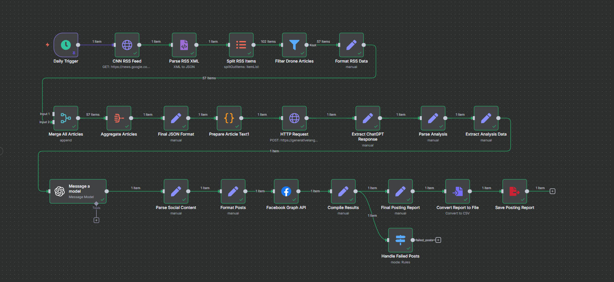
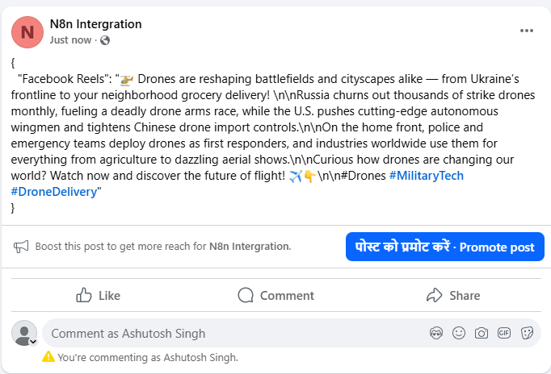

# Social Media AI Agent

Automated Drone News Aggregator & Facebook Poster (n8n Workflow)

This project is an n8n automation workflow that:

1. Collects the latest drone-related news articles via **Google News RSS**.  
2. Filters and formats the articles.  
3. Uses **Google Gemini** (and optionally OpenAI) to summarize and generate social media–ready captions.  
4. Automatically posts the results to a **Facebook Page** via the **Facebook Graph API**.  
5. Generates a **posting report** in JSON for audit and logging.

  

---

## 🚀 Features

- **Daily Automation**: Triggered every 24 hours.  
- **RSS Scraper**: Fetches articles from Google News RSS feeds.  
- **Filtering**: Keeps only drone-related news.  
- **AI Summarization**:
  - Google Gemini (`generateContent` API) for summaries, keywords, and hashtags.
  - OpenAI GPT (via n8n node) for short, platform-optimized captions.  
- **Social Posting**: Publishes summarized content directly to a connected Facebook Page.  
- **Logging & Reports**:
  - JSON report with results of posting attempts.
  - Handles failed posts separately.

---

## 📂 Workflow Overview

### Main Nodes
- **Schedule Trigger** → Runs workflow once every 24 hours.  
- **HTTP Request (Google News RSS)** → Fetches latest articles.  
- **Parse RSS XML** → Converts RSS feed into structured JSON.  
- **Split RSS Items** → Splits articles into individual items.  
- **Filter Drone Articles** → Keeps only articles containing the keyword `"drone"`.  
- **Format RSS Data & Aggregate Articles** → Normalizes article fields and merges them.  
- **Prepare Article Text** → Builds AI-friendly prompt for summarization.  
- **Gemini API Call** → Summarizes content into:
  - Cohesive summary (3–5 sentences)
  - Trending keywords
  - Relevant hashtags  
- **OpenAI (Message a Model)** → Generates platform-specific captions.  
- **Facebook Graph API** → Posts summarized content to the Facebook Page.  
- **Compile & Save Report** → Creates JSON posting report for audit.

---

## 🔧 Requirements

- **n8n** (self-hosted or cloud).  
- **Facebook Page & Access Token** with:
  - `pages_manage_posts`
  - `pages_read_engagement`
  - `pages_show_list`
- **Google API Key** for Gemini (`generativelanguage.googleapis.com`).  
- (Optional) **OpenAI API Key** for GPT-4.1-mini caption generation.  

---

## ⚡ Usage

1. Import the provided workflow JSON into n8n.  
2. Configure credentials:
   - Facebook Graph API → Use a Page Access Token.  
   - Google Gemini → Add API key in HTTP Request node.  
   - OpenAI → Connect account in OpenAI node.  
3. Activate the workflow.  
4. Posts will now be published daily to your Facebook Page.  

---

## 📊 Output

- Facebook posts appear on your Page with AI-generated summaries & hashtags.  
- JSON report saved (includes timestamps, success/failure, post IDs).  

  

---

## 📌 Future Improvements
- Multi-platform support (LinkedIn, Twitter/X).  
- Image scraping & posting.  
- Auto-tagging companies/people from articles.  
- Error retries with exponential backoff.

---

## 📝 License
This project is for personal & educational use. Check Facebook’s [Platform Policies](https://developers.facebook.com/policy/) before using in production.
